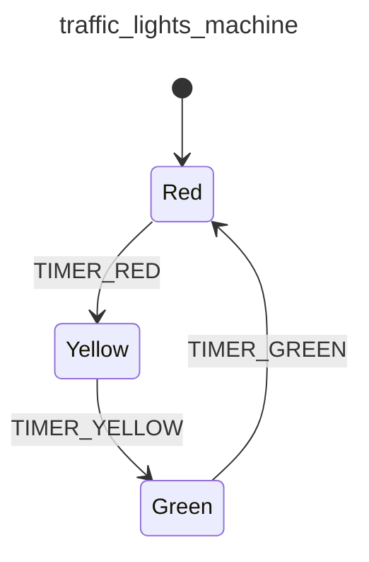

<div class="grid grid-cols-3 gap-4">

<div class="col-span-2">

# ⚙ Actions I

```php {10-14} {maxHeight:'400px'}
[
    'id' => 'traffic_lights_machine',
    'context' => [
        'red_duration'      => 30,
        'yellow_duration'   => 5,
        'green_duration'    => 20,
    ],
    'initial' => 'red',
    'states' => [
        'red' => [
            'on' => [
                Action?
                'TIMER_RED' => 'yellow'
            ]
        ],
        'yellow' => [
            'on' => [
                'TIMER_YELLOW' => 'green'
            ]
        ],
        'green' => [
            'on' => [
                'TIMER_GREEN' => 'red'
            ]
        ],
    ],
]
```
</div>

<div class="text-center">



</div>
</div>

<!--
makinenin baslangic state'indeki transition'a odaklanalim

burada diyoruz ki, TIMER_RED event'i geldigi zaman red durumundan yellow'a gecer makinenin state'i

sari isik durumuna gectigimiz icin ayni zamanda diyebilmeliyiz ki, makine bu gecisle birlikte sari isigi yakmasi lazim

iste makinelerin bu sekilde yapmasi gereken gorevlere action'lar diyoruz
-->
