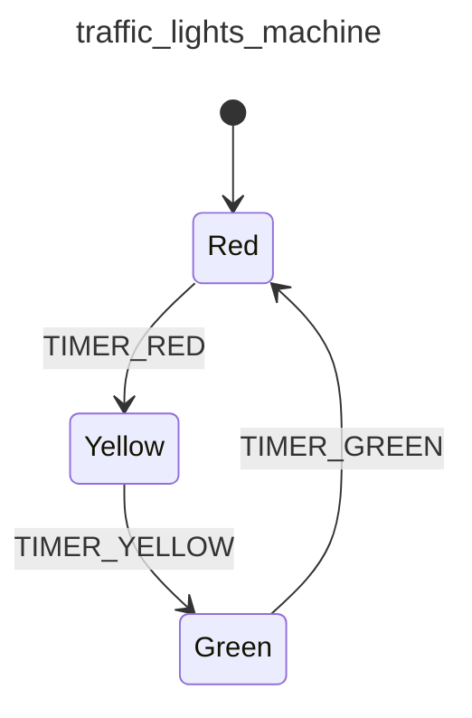

<div class="grid grid-cols-3 gap-4">

<div class="col-span-2">

# ⚙ Actions II

```php {12-15} {maxHeight:'400px'}
[
    'id' => 'traffic_lights_machine',
    'context' => [
        'red_duration'      => 30,
        'yellow_duration'   => 5,
        'green_duration'    => 20,
    ],
    'initial' => 'red',
    'states' => [
        'red' => [
            'on' => [
                'TIMER_RED' => [
                    'target' => 'yellow',
                    'actions' => ?,
                ],
            ]
        ],
        'yellow' => [
            'on' => [
                'TIMER_YELLOW' => 'green'
            ]
        ],
        'green' => [
            'on' => [
                'TIMER_GREEN' => 'red'
            ]
        ],
    ],
]
```
</div>

<div class="text-center">



</div>
</div>

<!--
bu noktada artik daha detayli bir transition tanimina ihtiyacimiz var, cunku transition'la birlikte action'lar calistirmak istiyoruz

bu yuzden event'in karsisini bir array'e ceviriyoruz
target ile bu transition sonucunda hedefledigimiz state'i yaziyoruz

actions kisminda da calistirmak istedigimiz action'lari yazacagiz
-->
