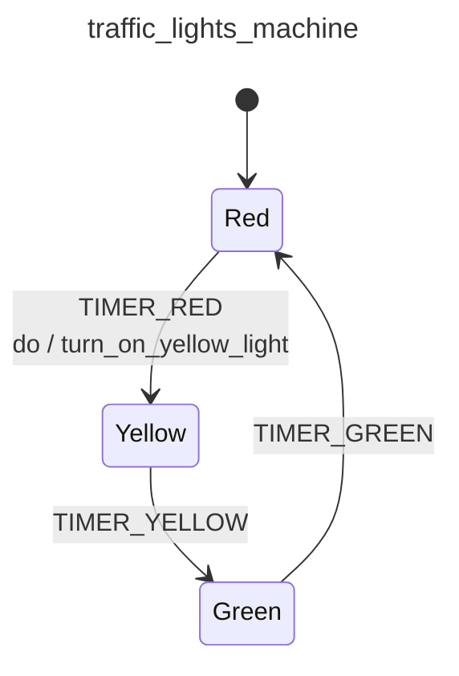

<div class="grid grid-cols-3 gap-4">

<div class="col-span-2">

# ⚙ Actions III

```php {14-14} {maxHeight:'400px'}
[
    'id' => 'traffic_lights_machine',
    'context' => [
        'red_duration'      => 30,
        'yellow_duration'   => 5,
        'green_duration'    => 20,
    ],
    'initial' => 'red',
    'states' => [
        'red' => [
            'on' => [
                'TIMER_RED' => [
                    'target'  => 'yellow',
                    'actions' => 'turn_on_yellow_light',
                ],
            ]
        ],
        'yellow' => [
            'on' => [
                'TIMER_YELLOW' => 'green'
            ]
        ],
        'green' => [
            'on' => [
                'TIMER_GREEN' => 'red'
            ]
        ],
    ],
]
```
</div>

<div class="text-center">



</div>
</div>

<!--
red state'ten yellow state'e gecerken, sari isigi yakmak istedigimiz icin;

actions'un karsisina calistirmak istedigimiz action'imizin ismini yazdik

tam da bu nokta genel olarak event machine paketi konsepti acisindan cok onemli.

soyle ki;

buradaki action yani 'turn_on_yellow_light' aslinda sadece bi' string. yani teknik olarak hic bisi yapmiyor, sadece yapilmasi gereken isin yani action'un adi

az once event machine konseptini konusurken config kismi icin makinenin ne yapacaginin tanimlandigi yerdir dedik

burada da bunu tanimlamis olduk, nasil yapacagi kismini ayrica ayrica tanimlayacagiz

kisaca neden boyle kismina deginebilirim burada;

bu hem implementasyon detaylari arasinda kaybolmadan bu makinede ne olup bittigini hizlica anlamamiza yariyor

dusunsenize surada 50-100 satirlik bir isigi yapmak fonksiyonu olsaydi, bu makine icinde coktan kaybolmustuk

diger bir acidan da sadece bu config'i alip, makineyi gorsellestirebiliriz, yandaki diagrami cizmek icin hic bir implementasyon detayina ihtiyacimiz yok aslinda

action'u diagramda da gosterdik, surada gorebiliriz

son olarak makinenin calismasini tekrar dusunelim

makine red state'ten yellow'a gidiyor ve dedik ki:
sari duruma gecerken, sari isigi yak

fakat kirmizi isik zaten yaniyorsa, once onu sondurmemiz gerekiyor aslinda

(burada tabi gercegi biraz daha basite indirgiyor ve ayni anda 2 isigin birden yanmadigini varsayiyoruz su asamada)
-->
