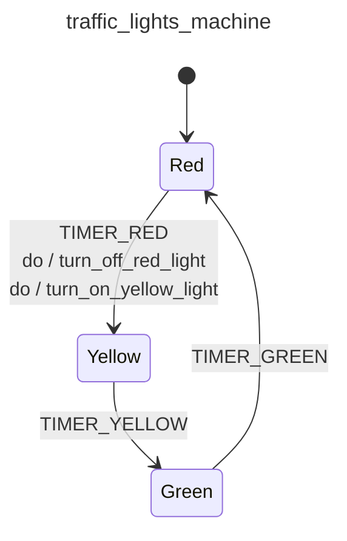

<div class="grid grid-cols-3 gap-4">

<div class="col-span-2">

# ⚙ Actions IV

```php {14-17} {maxHeight:'400px'}
[
    'id' => 'traffic_lights_machine',
    'context' => [
        'red_duration'      => 30,
        'yellow_duration'   => 5,
        'green_duration'    => 20,
    ],
    'initial' => 'red',
    'states' => [
        'red' => [
            'on' => [
                'TIMER_RED' => [
                    'target'  => 'yellow',
                    'actions' => [
                        'turn_off_red_light',
                        'turn_on_yellow_light',
                    ],
                ],
            ]
        ],
        'yellow' => [
            'on' => [
                'TIMER_YELLOW' => 'green'
            ]
        ],
        'green' => [
            'on' => [
                'TIMER_GREEN' => 'red'
            ]
        ],
    ],
]
```
</div>

<div class="text-center">



</div>
</div>

<!--
sari isigi yaktigimiz action'u eklemistik, simdi de kirmizi isigi sondurme action'ini eklemeliyiz
-->
