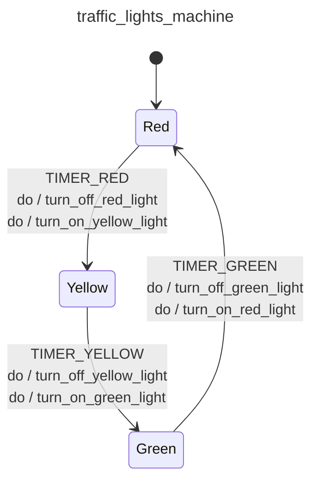

<div class="grid grid-cols-3 gap-4">

<div class="col-span-2">

# ⚙ Actions V

```php {12,15-16,23,26-27,34,37-38} {maxHeight:'400px'}
[
    'id' => 'traffic_lights_machine',
    'context' => [
        'red_duration'      => 30,
        'yellow_duration'   => 5,
        'green_duration'    => 20,
    ],
    'initial' => 'red',
    'states' => [
        'red' => [
            'on' => [
                'TIMER_RED' => [
                    'target'  => 'yellow',
                    'actions' => [
                        'turn_off_red_light',
                        'turn_on_yellow_light',
                    ],
                ],
            ]
        ],
        'yellow' => [
            'on' => [
                'TIMER_YELLOW' => [
                    'target'  => 'green',
                    'actions' => [
                        'turn_off_yellow_light',
                        'turn_on_green_light',
                    ],
                ],
            ]
        ],
        'green' => [
            'on' => [
                'TIMER_GREEN' => [
                    'target'  => 'red',
                    'actions' => [
                        'turn_off_green_light',
                        'turn_on_red_light',
                    ],
                ],
            ]
        ],
    ],
]
```
</div>

<div class="text-center">



</div>
</div>

<style>
    code {
        @apply text-xs leading-tight;
    }
</style>

<!--
ayni sekilde tum lambalari yakma/sondurme action'larimizi bu sekilde tanimlayabiliriz.


bu asamadan sonra makineye soyle uzaktan bi' bakinca, bu iste tecrube edindikce su pattern'lari farketmeye baslayacagiz.

makinenin calismasindan itibaren bakacak olursak;
kirmizi durumdan cikarken kirmizi lambayi kapatiyor
sari duruma girerken de sari lambayi aciyor

biz butun bu action'lari biraz biraz farkli bir terminoloji ile dusunebiliriz.
-->
