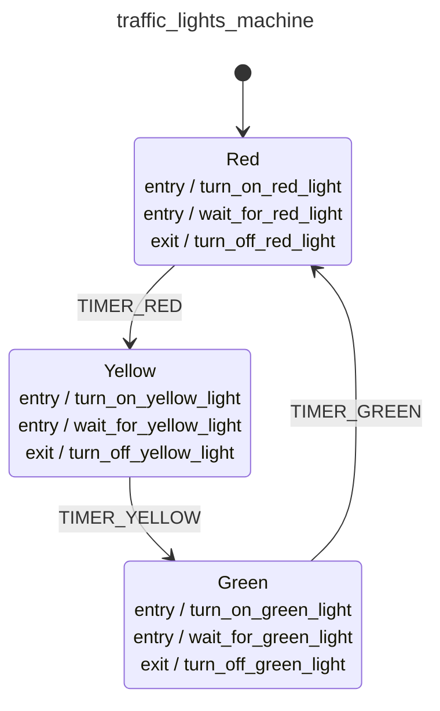

<div class="grid grid-cols-3 gap-4">

<div class="col-span-2">

# ⚙ Actions VI

```php {3-7,13,21,29} {maxHeight:'400px'}
[
    'id' => 'traffic_lights_machine',
    'context' => [
        'red_duration'      => 30,
        'yellow_duration'   => 5,
        'green_duration'    => 20,
    ],
    'initial' => 'red',
    'states' => [
        'red' => [
            'entry' => [
                'turn_on_red_light',
                'wait_for_red_light',
            ],
            'exit'  => 'turn_off_red_light',
            'on' => ['TIMER_RED' => 'yellow']
        ],
        'yellow' => [
            'entry' => [
                'turn_on_yellow_light',
                'wait_for_yellow_light',
            ],
            'exit'  => 'turn_off_yellow_light',
            'on' => ['TIMER_YELLOW' => 'turn_off_yellow_light']
        ],
        'green' => [
            'entry' => [
                'turn_on_green_light',
                'wait_for_green_light',
            ],
            'exit'  => 'turn_off_green_light',
            'on' => ['TIMER_GREEN' => 'turn_off_green_light']
        ],
    ],
]
```
</div>

<div class="text-center">



</div>
</div>

<style>
    code {
        @apply text-xs leading-tight;
    }
</style>

<!--
machine context'e bakarken, hala lambalarin kac sn yanmasi gerektigini tanimlamamistik diye bahsetmistik,

buraya kadarki tanimlamalardan ve konseptlerden sonra bunu tanimlayabiliriz

naif bi' implementasyonla diyebiliriz ki, transition icinde machine context'te tanimlan sn kadar bekle ve sonra transition bitmis olsun

bu amacla her bir isigi yaktiktan sonra gerekli miktarda bekledigimiz action'lar tanimlayalim, bunlari tanimlamak icin mantikli nokta yine entry action'lar gibi gorunuyor
-->
