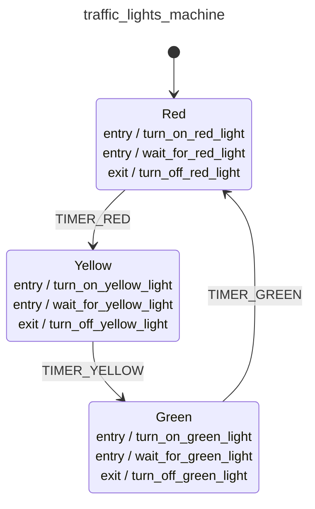

<div class="grid grid-cols-3 gap-4">

<div class="col-span-2">

# 🛩️ Behavior

```php {3} {maxHeight:'400px'}
[
    config: [...],
    behavior: ?,
]
```
</div>

<div class="text-center">



</div>
</div>

<style>
    code {
        @apply text-xs leading-tight;
    }
</style>

<!--
simdiye kadar hep makinenin ne yapacagi konusunda tanimlamalar yaptik.

daha once event machine konseptini genel olarak gosterdigim slaytta bahsettigim gibi bir de makinenin nasil calisacagi, nasil davranacagi konusu var.

simdiye kadarki yazdiklarimizi, array icinde config altina aliyoruz ve bunlardan ayri olarak makine davranislarini tanimlamak uzere devam ediyoruz.

makine davranislari kod olarak tanimlandigi icin diagram uzerinde gostermek mantikli olmaz.

simdiye kadar hic implementasyon  yazmadik fakat makinein davranisi hakkinda inanilmaz cok bilgiye sahibiz.
daha guzeli gercekten nerede ne implementasyon yapmamiz gerektigine dair inanilmaz net bilgiye sahibiz.

configurasyon'la behavi'lari ayirmanin boyle bir faydasi var, hic kod yazmadan isleyisi cikarabilir, uzerine kafa yorabilir, gereksiz implementasyonlar kacinabiliriz vs.
-->
