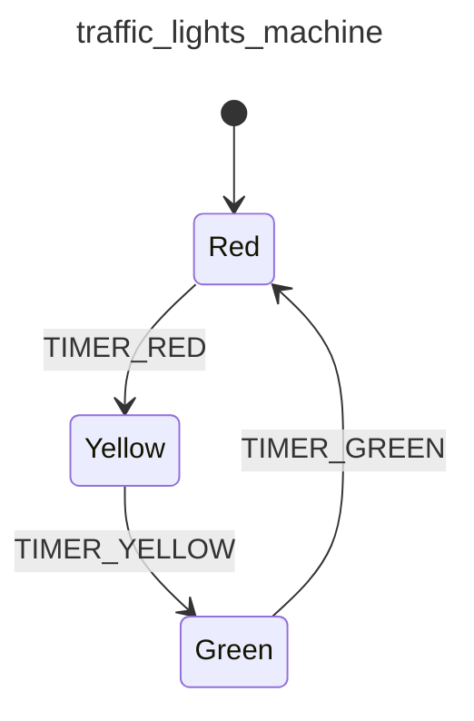

<div class="grid grid-cols-3 gap-4">

<div class="col-span-2">

# ⚙ Context I (Extended State)

```php {3-5} {maxHeight:'400px'}
[
    'id' => 'traffic_lights_machine',
    How long should the lights be on 🔴?
                                     🟡?
                                     🟢?
    'initial' => 'red',
    'states' => [
        'red' => [
            'on' => [
                'TIMER_RED' => 'yellow'
            ]
        ],
        'yellow' => [
            'on' => [
                'TIMER_YELLOW' => 'green'
            ]
        ],
        'green' => [
            'on' => [
                'TIMER_GREEN' => 'red'
            ]
        ],
    ],
]
```
</div>

<div class="text-center">



</div>
</div>

<!--
buraya kadar teorik bir makine tanimladik,

aslinda konsept kisminda biraz degindigimiz bu makine ne yapar sorusuna cevap verdik genel olarak.

simdi biraz nasil yapar kismina yani makinenin davranisina/behavior'una dokunan tanimlamalari dusunecegiz

bu da context:

context'e ayni zamanda extended state deniyor.

makinenin internal durumu, icinde tuttugu bilgi
diger bir deyisle makinenin calistirken ihtiyac duyacagi bilgiler

trafik lambalari analojisinden devam edersek, simdiye kadar hangi durumlarin ya da lambalarin oldugunu ve hangisinden sonra hangisinin yanacagini tanimladik, sadece bu kadar

fakat hangi lambanin kac saniye yanacagi davranisiyla ilgili hic bisi tanimlamadik

bu tanim tam bir extended state ornegi, cunku yeni bir state degil, o state ozelinde nasil davranmasi gerektigine ozel bir internal bilgi
-->
