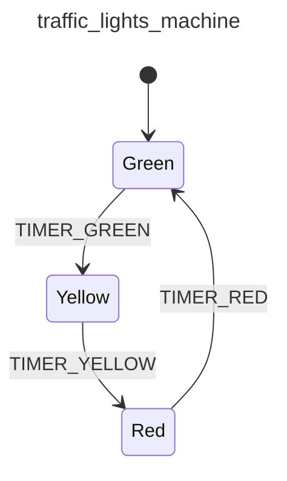

<div class="grid grid-cols-3 gap-4">

<div class="col-span-2">

# ⚙ Context II (Extended State)

```php {3-3} {maxHeight:'400px'}
[
    'id' => 'traffic_lights_machine',
    'context' => [],
    'initial' => 'red',
    'states' => [
        'red' => [
            'on' => [
                'TIMER_RED' => 'yellow'
            ]
        ],
        'yellow' => [
            'on' => [
                'TIMER_YELLOW' => 'green'
            ]
        ],
        'green' => [
            'on' => [
                'TIMER_GREEN' => 'red'
            ]
        ],
    ],
]
```
</div>

<div class="text-center">



</div>
</div>

<!--
context'i de configurasyon uzerinden yine 'context' key'i ile tanimliyoruz

context array'i icinde ihtiyacimiz olan her tur veri tipini tanimlayabiliriz gibi dusunebilirz simdilik.
-->
