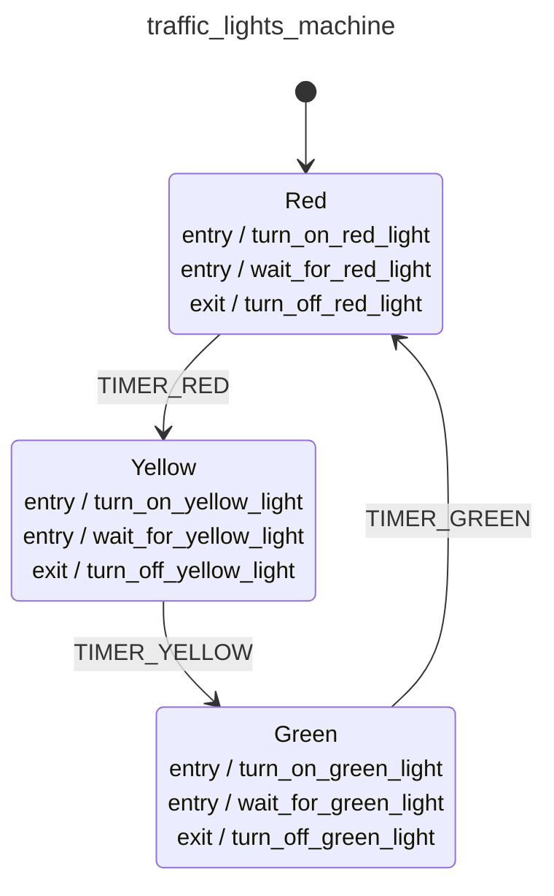

<div class="grid grid-cols-3 gap-4">

<div class="col-span-2">

# 🛩️ Definition I

```php {3} {maxHeight:'400px'}
[
    config:   [...],
    behavior: [...],
]
```
</div>

<div class="text-center">



</div>
</div>

<style>
    code {
        @apply text-xs leading-tight;
    }
</style>

<!--
simdiye kadar hem configuration'u hem de behavior'u
yani makinenin neleri naasil yapacaginit tanimladik

buradan sonra ilk konsepte bahsedilen yoldan devam etmek gerekirse definition kismi geliyor

butun bu yaptigimiz tanimlara bir anlam getirme gibi dusunebiliriz.

simdiye kadar aslinda sadece bir array uzerinde tanimlamalar yaptik
-->
