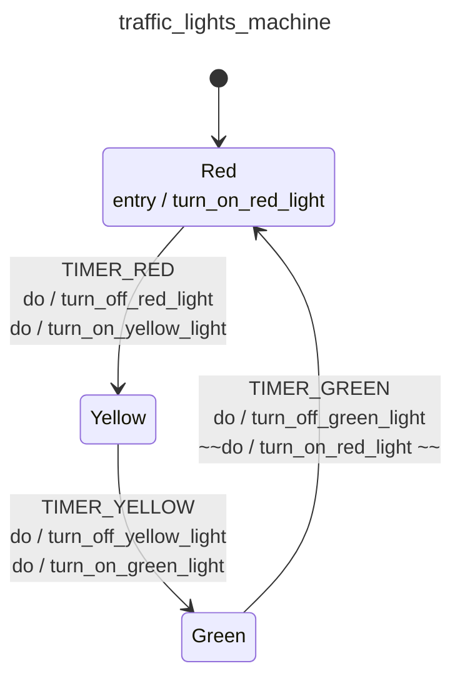

<div class="grid grid-cols-3 gap-4">

<div class="col-span-2">

# ⚙ Entry Actions I

```php {11-13,41} {maxHeight:'400px'}
[
    'id' => 'traffic_lights_machine',
    'context' => [
        'red_duration'      => 30,
        'yellow_duration'   => 5,
        'green_duration'    => 20,
    ],
    'initial' => 'red',
    'states' => [
        'red' => [
            'entry' => [
                'turn_on_red_light',
            ],
            'on' => [
                'TIMER_RED' => [
                    'target'  => 'yellow',
                    'actions' => [
                        'turn_off_red_light',
                        'turn_on_yellow_light',
                    ],
                ],
            ]
        ],
        'yellow' => [
            'on' => [
                'TIMER_YELLOW' => [
                    'target'  => 'green',
                    'actions' => [
                        'turn_off_yellow_light',
                        'turn_on_green_light',
                    ],
                ],
            ]
        ],
        'green' => [
            'on' => [
                'TIMER_GREEN' => [
                    'target'  => 'red',
                    'actions' => [
                        'turn_off_green_light',
                         ~~'turn_on_red_light',~~
                    ],
                ],
            ]
        ],
    ],
]
```
</div>

<div class="text-center">



</div>
</div>

<style>
    code {
        @apply text-xs leading-tight;
    }
</style>

<!--
buradaki action'lari transition seviyesinde gerceklesen action'lar degil de;

bir state'e giris yapinca gerceklesen action'lar gibi de dusunebiliriz;

soyle ki;
state bazinda; bir transition sonucunda Red state'e girdiginde kirmizi isigi yak diye bir tanimlama yapabilirim

ve boylece yesilden kirmiziya gecisteki; kirmizi isigi yak action'unu kaldirabilirim

boylece action'lari daha alakali yerlere koyduk gibi dusunebilirsiniz.
-->
