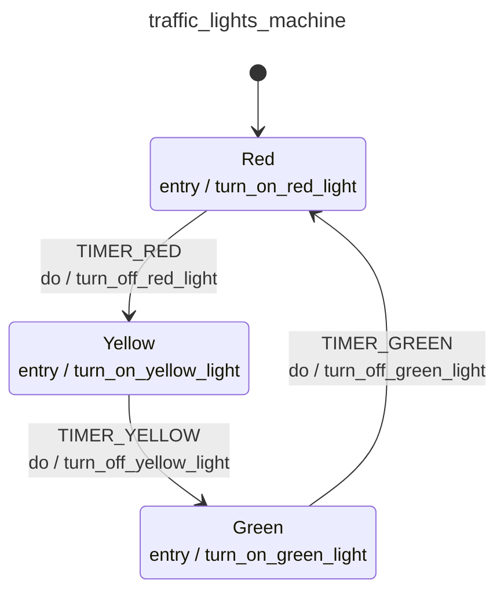

<div class="grid grid-cols-3 gap-4">

<div class="col-span-2">

# ⚙ Entry Actions II

```php {7,16,25} {maxHeight:'400px'}
[
    'id' => 'traffic_lights_machine',
    'context' => [...],
    'initial' => 'red',
    'states' => [
        'red' => [
            'entry' => 'turn_on_red_light',
            'on' => [
                'TIMER_RED' => [
                    'target'  => 'yellow',
                    'actions' => 'turn_off_red_light',
                ],
            ]
        ],
        'yellow' => [
            'entry' => 'turn_on_yellow_light',
            'on' => [
                'TIMER_YELLOW' => [
                    'target'  => 'green',
                    'actions' => 'turn_off_yellow_light',
                ],
            ]
        ],
        'green' => [
            'entry' => 'turn_on_green_light',
            'on' => [
                'TIMER_GREEN' => [
                    'target'  => 'red',
                    'actions' => 'turn_off_green_light',
                ],
            ]
        ],
    ],
]
```
</div>

<div class="text-center">



</div>
</div>

<style>
    code {
        @apply text-xs leading-tight;
    }
</style>

<!--
entry action'lara gore duzenlemeyi tum state'ler icin uyguladigimizda boyle bir config ve diagram ortaya cikacak

degisiklikler diagram uzerinde de uygulandi ve boyle gorundu

bu asamaya geldikten sonra entry action'lar karsisinda bir de exit action'lar oldugunu tahmin etmek zor degil
-->
