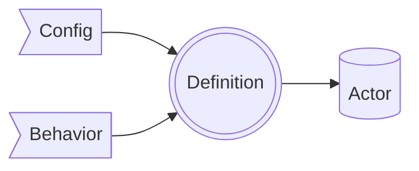

# ⚙ EventMachine
## Concept

<!--
Event Machine paketine cok ustten bir bakis, nasil bir konsepte sahip

Config: makinenin ne yaptigi

Behavior: makinenin (config'te tanimlanan) ne'leri nasil yapacagi, gercekten makinenin davranisi

Definition: Config ve Behavior'un bir araya getirilmis, duzene konulmus hali

Actor: Definition harekete gectiginde ortaya cikan nesne, makinenin calistirilmasi.

Definition durumunda makine bir plandan ibaret, calistirilana kadar
-->
