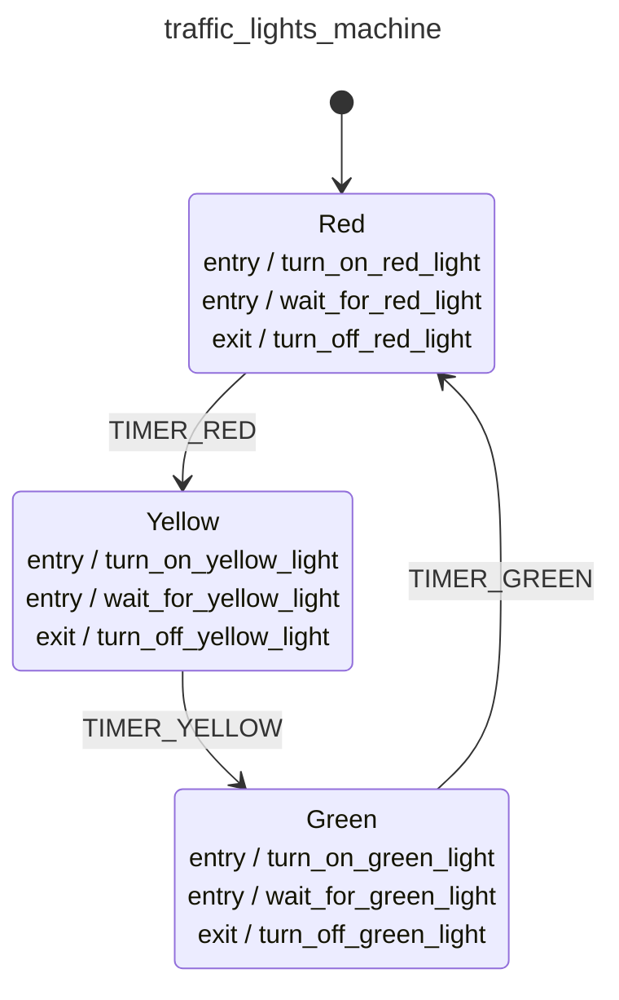

<div class="grid grid-cols-3 gap-4">

<div class="col-span-2">

# 🛩️ Event Machines II

```php {all} {maxHeight:'400px'}
class TrafficLightsMachine extends EventMachine
{
    public static function build(): MachineDefinition
    {
        return [
            config: [
                'id' => 'traffic_lights_machine',
                'context' => [
                    'red_duration'      => 30,
                    'yellow_duration'   => 5,
                    'green_duration'    => 20,
                ],
                'initial' => 'red',
                'states' => [
                    'red' => [
                        'entry' => [
                            'turn_on_red_light',
                            'wait_for_red_light',
                        ],
                        'exit'  => 'turn_off_red_light',
                        'on' => [
                            'TIMER_RED' => [
                                [
                                    'target' => 'power_off',
                                    'guards' => 'is_power_off'
                                ],
                                [
                                    'target' => 'yellow'
                                ],
                            ],
                        ],
                    ],
                    'yellow' => [
                        'entry' => [
                            'turn_on_yellow_light',
                            'wait_for_yellow_light',
                        ],
                        'exit'  => 'turn_off_yellow_light',
                        'on' => [
                            'TIMER_YELLOW' => 'green'
                        ]
                    ],
                    'green' => [
                        'entry' => [
                            'turn_on_green_light',
                            'wait_for_green_light',
                        ],
                        'exit'  => 'turn_off_green_light',
                        'on' => [
                            'TIMER_GREEN' => 'green'
                        ]
                    ],
                    'power_off' => [
                        'on' => [
                            'POWER_ON' => [
                                'guards' => 'is_power_on',
                                'actions' => 'report_power_on',
                            ],
                        ]
                    ]
            ],
            behavior: [
                'guards' => [
                    'is_power_on' => function (ContextManager $context, EventDefinition $eventDefinition): bool {
                        return $context->get('power') === 'on';
                    },
                    'is_power_off' => function (ContextManager $context, EventDefinition $eventDefinition): bool {
                        return $context->get('power') === 'off';
                    },
                ],
                'actions' => [
                    'report_power_on' => function (ContextManager $context, EventDefinition $eventDefinition): void {
                        echo '🔌 Power is ON' . PHP_EOL;
                    },
                    'wait_for_red_light' => function (ContextManager $context, EventDefinition $eventDefinition): void {
                        sleep($context->get('red_duration'));
                    },
                    'wait_for_yellow_light' => function (ContextManager $context, EventDefinition $eventDefinition): void {
                        sleep($context->get('yellow_duration'));
                    },
                    'wait_for_green_light' => function (ContextManager $context, EventDefinition $eventDefinition): void {
                        sleep($context->get('green_duration'));
                    },
                    'turn_on_red_light' => function (ContextManager $context, EventDefinition $eventDefinition): void {
                        echo '🚦 Red Light is ON' . PHP_EOL;
                    },
                    'turn_off_red_light' => function (ContextManager $context, EventDefinition $eventDefinition): void {
                        echo '🚦 Red Light is OFF' . PHP_EOL;
                    },
                    'turn_on_yellow_light' => function (ContextManager $context, EventDefinition $eventDefinition): void {
                        echo '🚦 Yellow Light is ON' . PHP_EOL;
                    },
                    'turn_off_yellow_light' => function (ContextManager $context, EventDefinition $eventDefinition): void {
                        echo '🚦 Yellow Light is OFF' . PHP_EOL;
                    },
                    'turn_on_green_light' => function (ContextManager $context, EventDefinition $eventDefinition): void {
                        echo '🚦 Green Light is ON' . PHP_EOL;
                    },
                    'turn_off_green_light' => function (ContextManager $context, EventDefinition $eventDefinition): void {
                        echo '🚦 Green Light is OFF' . PHP_EOL;
                    },
                ],
            ],
        ]);
    }

}
```
</div>

<div class="text-center">



</div>
</div>

<style>
    code {
        @apply text-xs leading-tight;
    }
</style>

<!--
bizim sistemlerde bu tanimlamalar belki binlerce satir olabilir degil mi?

onun icin de soyle cozumlerimiz var
-->
