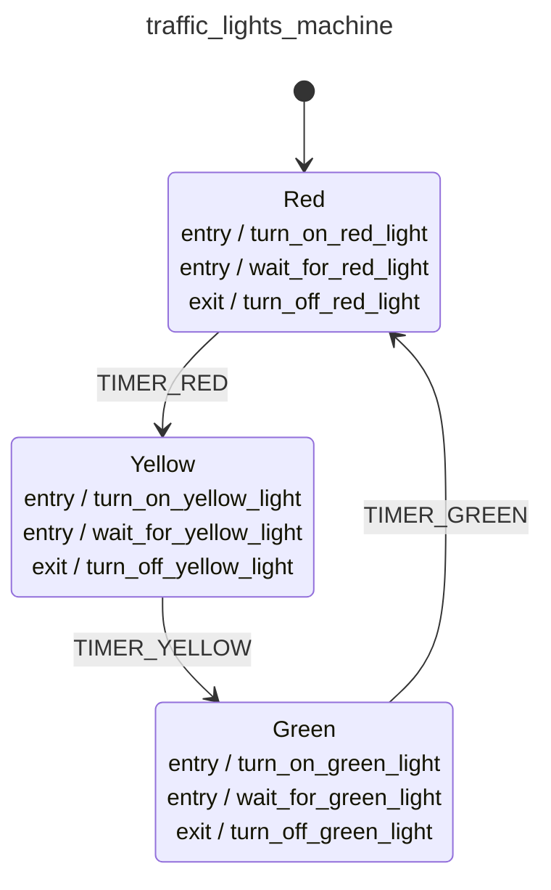

<div class="grid grid-cols-3 gap-4">

<div class="col-span-2">

# 🛩️ Event Machines III

```php {all} {maxHeight:'400px'}
class TrafficLightsMachine extends EventMachine
{
    public static function build(): MachineDefinition
    {
        return [
            config: [
                'id' => 'traffic_lights_machine',
                'context' => MachineContext::class,
                'initial' => 'red',
                'states' => [
                    'red' => [
                        'entry' => [
                            TurnOnRedLightAction::class,
                            WaitForRedLightAction::class,
                        ],
                        'exit'  => TurnOffRedLightAction::class,
                        'on' => [
                            TimerRedEvent::class => [
                                [
                                    'target' => 'power_off',
                                    'guards' => IsPowerOffGuard::class
                                ],
                                [
                                    'target' => 'yellow'
                                ],
                            ],
                        ],
                    ],
                    'yellow' => [
                        'entry' => [
                            TurnOnYellowLightAction::class,
                            WaitForYellowLightAction::class,
                        ],
                        'exit'  => TurnOffYellowLightAction::class,
                        'on' => [
                            TimerYellowEvent::class => 'green'
                        ]
                    ],
                    'green' => [
                        'entry' => [
                            TurnOnGreenLightAction::class,
                            WaitForGreenLightAction::class,
                        ],
                        'exit'  => TurnOffGreenLightAction::class,
                        'on' => [
                            TimerGreenEvent::class => 'green'
                        ]
                    ],
                    'power_off' => [
                        'on' => [
                            PowerOnEvent::class => [
                                'guards' => IsPowerOnGuard::class,
                                'actions' => ReportPowerOnAction::class,
                            ],
                        ]
                    ]
            ]);
    }

}
```
</div>

<div class="text-center">



</div>
</div>

<style>
    code {
        @apply text-xs leading-tight;
    }
</style>

<!--
bizim sistemlerde bu tanimlamalar belki binlerce satir olabilir degil mi?

onun icin de soyle cozumlerimiz var
-->
