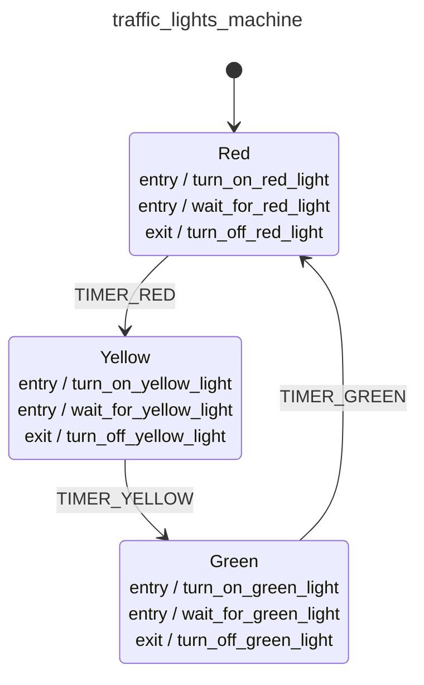

<div class="grid grid-cols-3 gap-4">

<div class="col-span-2">

# 🛩️ Event Machines IV

```php {all} {maxHeight:'400px'}
class TrafficLightsMachine extends EventMachine
{
    public static function build(): MachineDefinition
    {
        return [
            config:   [...],
            behavior: [
                'context' => [...],
                'actions' => [...],
                'guards' => [...],
                'events' => [...],
            ],
        ];
    }

}
```
</div>

<div class="text-center">



</div>
</div>

<style>
    code {
        @apply text-xs leading-tight;
    }
</style>

<!--
bizim sistemlerde bu tanimlamalar belki binlerce satir olabilir degil mi?

onun icin de soyle cozumlerimiz var
-->
