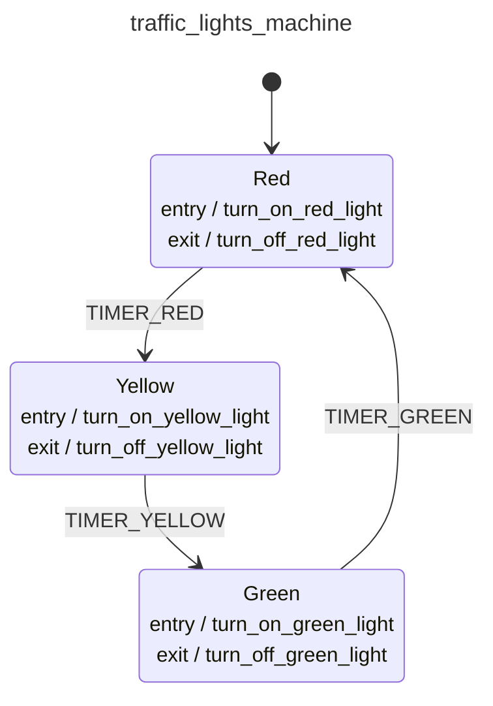

<div class="grid grid-cols-3 gap-4">

<div class="col-span-2">

# ⚙ Exit Actions I

```php {8,15,22} {maxHeight:'400px'}
[
    'id' => 'traffic_lights_machine',
    'context' => [...],
    'initial' => 'red',
    'states' => [
        'red' => [
            'entry' => 'turn_on_red_light',
            'exit'  => 'turn_off_red_light',
            'on' => [
                'TIMER_RED' => 'yellow',
            ]
        ],
        'yellow' => [
            'entry' => 'turn_on_yellow_light',
            'exit'  => 'turn_off_yellow_light',
            'on' => [
                'TIMER_YELLOW' => 'turn_off_yellow_light',
            ]
        ],
        'green' => [
            'entry' => 'turn_on_green_light',
            'exit'  => 'turn_off_green_light',
            'on' => [
                'TIMER_GREEN' => 'turn_off_green_light',
            ]
        ],
    ],
]
```
</div>

<div class="text-center">



</div>
</div>

<style>
    code {
        @apply text-xs leading-tight;
    }
</style>

<!--
ayni mantikla, bir state'ten cikis aninda uygulamansi gereken action'lari exit action'lar altinda toplayinca, ortaya soyle bir goruntu cikiyor;

entry/exit action'lari state bazinda tanimladik, gereksiz tekrarlari engellemis olduk, action'lari mantiksal olarak daha alakali yerlere almis olduk.

burada action'larin tanimlama sekline yine bir dikkat cekeyim;
tek bir action oldugunda bunu duz bir string olarak girebilirken, birden fazla oldugunda array olarak girebiliriz
duz string olarak girmeyi syntax olarak kisayol gibi dusunebilirsiniz
-->
