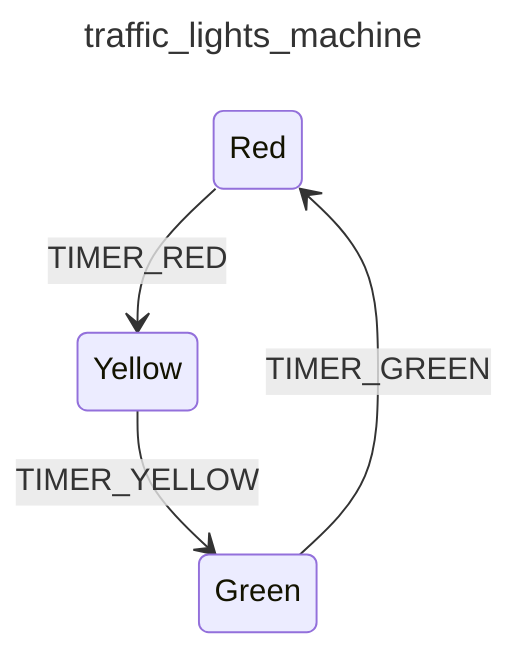

<div class="grid grid-cols-3 gap-4">

<div class="col-span-2">

# ⚙ Initial State I

```php {3-3} {maxHeight:'400px'}
[
    'id' => 'traffic_lights_machine',
    Initial State?
    'states' => [
        'red' => [
            'on' => [
                'TIMER_RED' => 'yellow'
            ]
        ],
        'yellow' => [
            'on' => [
                'TIMER_YELLOW' => 'green'
            ]
        ],
        'green' => [
            'on' => [
                'TIMER_GREEN' => 'red'
            ]
        ],
    ],
]
```
</div>

<div class="text-center">



</div>
</div>

<!--
eksik olan initial state

yani bu makine ilk calistirildigi zaman hangi state'ten/durumdan baslayacak

diger bi' deyisle diagramdaki dongunun baslangic noktasini tanimlamamiz gerekiyor
-->
