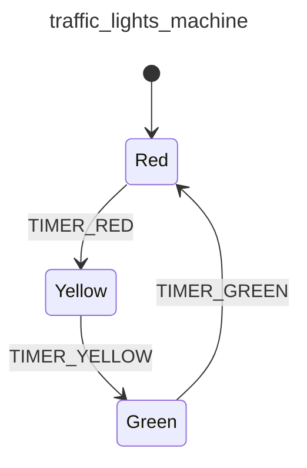

<div class="grid grid-cols-3 gap-4">

<div class="col-span-2">

# ⚙ Initial State II

```php {3-3} {maxHeight:'400px'}
[
    'id' => 'traffic_lights_machine',
    'initial' => 'red',
    'states' => [
        'red' => [
            'on' => [
                'TIMER_RED' => 'yellow'
            ]
        ],
        'yellow' => [
            'on' => [
                'TIMER_YELLOW' => 'green'
            ]
        ],
        'green' => [
            'on' => [
                'TIMER_GREEN' => 'red'
            ]
        ],
    ],
]
```
</div>

<div class="text-center">



</div>
</div>

<!--
onu da config'imize bir 'initial' key'i ekleyerek taniliyoruz

bu makine ilk calistirildiginda 'red' state ile baslar diye configure etmis olduk.
-->
