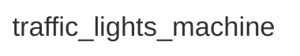

<div class="grid grid-cols-3 gap-4">

<div class="col-span-2">

# ⚙ Machine ID

```php {maxHeight:'400px'}
[
    'id' => 'traffic_lights_machine',
]
```

</div>

<div class="text-center">



</div>
</div>

<!--
burada en basitinden bir makine tasarlamakla basliyoruz

burada makinenin config/uration'unu tanimliyoruz, konsept kisminda dedigimiz gibi, ne yapabildigi -> makineyi tarif ediyoruz

bir makine dusunelim ve ona bir isim verelim

burada yaptigimiz tanimlamalar/config yan taraftaki diagramda gorsellestirilmeye calisilacak
-->
