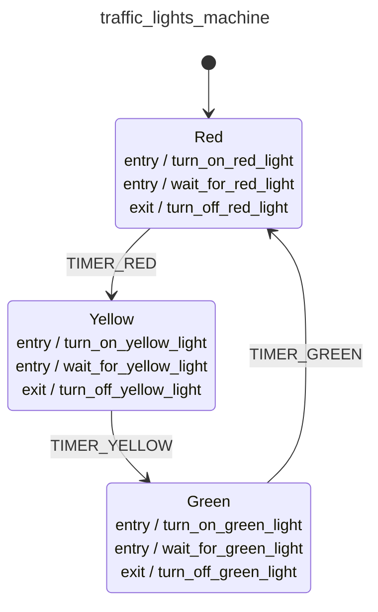

<div class="grid grid-cols-3 gap-4">

<div class="col-span-2">

# 🛩️ Pure Transitions I

```php {all} {maxHeight:'400px'}
$machineDefinition = MachineDefinition::define([
    config:   [...],
    behavior: [...],
]);

// Transitions as Pure Functions?
$machineDefinition->transition(?);
```
</div>

<div class="text-center">



</div>
</div>

<style>
    code {
        @apply text-xs leading-tight;
    }
</style>

<!--
Pure transitions bizim daha onceden hic bilmedigimiz hatta hic alisik olmadigimiz bir konsept.

az once bahsettigim gibi machine definition sadece bir tanim,

biz bu tanima, soyle bir durumda, soyle bir event alirsan, naparsin diye sorabiliriz,

soyle ki
-->
