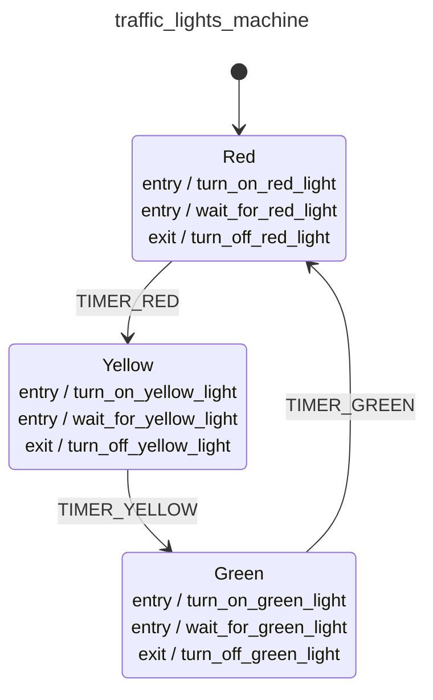

<div class="grid grid-cols-3 gap-4">

<div class="col-span-2">

# 🛩️ Pure Transitions II

```php {6-7} {maxHeight:'400px'}
$machineDefinition = MachineDefinition::define([
    config:   [...],
    behavior: [...],
]);

// Transitions as Pure Functions?
$machineDefinition->transition($state, $event);
```
</div>

<div class="text-center">



</div>
</div>

<style>
    code {
        @apply text-xs leading-tight;
    }
</style>

<!--
bunu transition methoduyla yapiyoruz

ilk parametre olarak makineye state'ini veriyoruz, buradaki state daha once bahsettiklerimizden farkli olarak, makinenin durumu demek, icinde context var, hangi transitionlari calistirmis daha once, yani kisaca bu hale nasil gelmis'in tanimi var

ve diyoruz ki, sen bu durumdayken, soyle bir event geldiginda naparsin
-->
