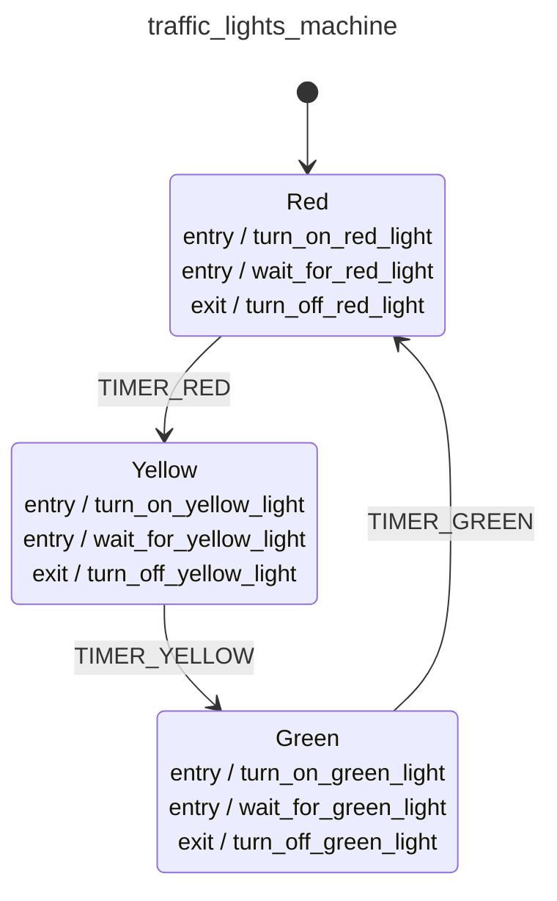

<div class="grid grid-cols-3 gap-4">

<div class="col-span-2">

# 🛩️ Pure Transitions III

```php {6-10} {maxHeight:'400px'}
$machineDefinition = MachineDefinition::define([
    config:   [...],
    behavior: [...],
]);

// Transitions as Pure Functions?
$machineDefinition->transition(
    state: $machineDefinition->initial, 
    event: ['type' => 'TIMER_RED'],
);
```
</div>

<div class="text-center">



</div>
</div>

<style>
    code {
        @apply text-xs leading-tight;
    }
</style>

<!--
bu sekilde bir transition gercelstirirsek, makinenin baslanlangic durumunda TIMER_RED event'i gerceklestiginde ne olur diye sormus oluryouz
-->
