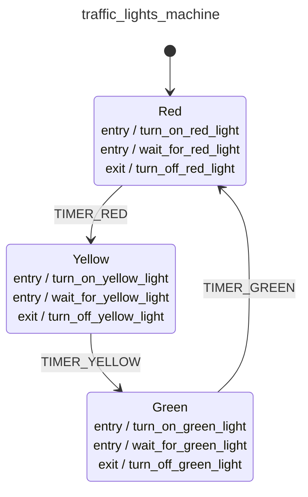

<div class="grid grid-cols-3 gap-4">

<div class="col-span-2">

# 🛩️ Pure Transitions IV

```php {6-10} {maxHeight:'400px'}
$machineDefinition = MachineDefinition::define([
    config:   [...],
    behavior: [...],
]);

// Transitions as Pure Functions?
$state = $machineDefinition->transition(
    state: null, 
    event: ['type' => 'TIMER_RED'],
);
```
</div>

<div class="text-center">



</div>
</div>

<style>
    code {
        @apply text-xs leading-tight;
    }
</style>

<!--
simdi bu transition'i izleyelim

burada diyoruz ki makine initial state'de yani red durumunda

burayi diagramdan takip edebiliriz

red durumundayken bir TIMER_RED event'i geliyor

makine YELLOW state'ine geciyor ve duruyor

iste makinin bu halie bir state objesi olarak bize geri donuyor

burada yine dikkatini cekmek istedigim sey, makine aslinda hic calismadi, su durumda soyle olurse ne olur dedik

bunu test acisindan cok faydali olacagini dusunebilirsiniz

application su durumdayken, soyle olursa ne olur gibi,
test'lerde test edecegimiz dunyayi onceden hazirlamamiz gerekiyordu

burada sadece ilgilili context'i hazirlamamiz gerekiyor.
-->
