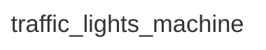

<div class="grid grid-cols-3 gap-4">

<div class="col-span-2">

# ⚙ States I

```php {3-3} {maxHeight:'400px'}
[
    'id' => 'traffic_lights_machine',
    States?
]
```

</div>

<div class="text-center">



</div>
</div>

<!--
trafik lambalari makinemizin, en basta, 3 tane farkli durumu var dedik, 3 farkli lamba icin
-->
