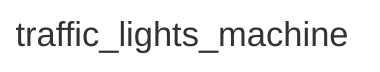

<div class="grid grid-cols-3 gap-4">

<div class="col-span-2">

# ⚙ States II

```php {3-3} {maxHeight:'400px'}
[
    'id' => 'traffic_lights_machine',
    'states' => [],
]
```

</div>

<div class="text-center">



</div>
</div>

<!--
terminoloji olarak makinenin durdugu ve durdugu yerde farkli davranislar gosterdigi durumlara : states diyoruz

bu config uzerinde de bunu 'states' olarak ifade edelim
-->
