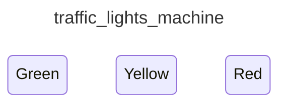

<div class="grid grid-cols-3 gap-4">

<div class="col-span-2">

# ⚙ States III

```php {3-7} {maxHeight:'400px'}
[
    'id' => 'traffic_lights_machine',
    'states' => [
        'red',
        'yellow',
        'green',
    ],
]
```

</div>

<div class="text-center">



</div>
</div>

<!--
3 state'imizi tanimladigimizda ortaya boyle bir diagram cikiyor

bu 3 farkli durumun su anda birbirleriyle alakasi yok, sadece durum tespiti yapmis olduk
-->
