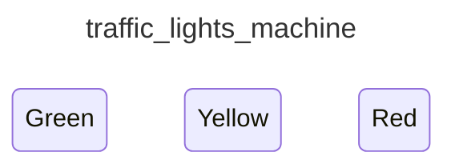

<div class="grid grid-cols-3 gap-4">

<div class="col-span-2">

# ⚙ Transitions I

```php {4-6} {maxHeight:'400px'}
[
    'id' => 'traffic_lights_machine',
    'states' => [
        'red' => [
            Transitions?
        ],
        'yellow',
        'green',
    ],
]
```

</div>

<div class="text-center">



</div>
</div>

<!--
farkli state'lerin birbirine baglanmasina da transition'lar diyoruz.

state icinde bu baglantilari bir sekilde tanimlamaliyiz
-->
