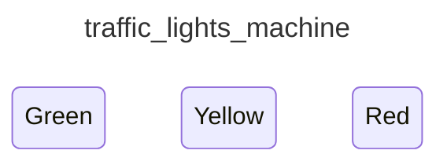

<div class="grid grid-cols-3 gap-4">

<div class="col-span-2">

# ⚙ Transitions II (Events)

```php {4-8} {maxHeight:'400px'}
[
    'id' => 'traffic_lights_machine',
    'states' => [
        'red' => [
            'on' => [
                Event Driven, What Event?
                🌪️ EVENT STORMING 🌪️
            ]
        ],
        'yellow',
        'green',
    ],
]
```

</div>

<div class="text-center">



</div>
</div>

<!--
bu noktada dusunmemiz gereken olay event'ler.

cunku makine farkli durumlar arasindaki gecisi event'lere tekip vererek gerceklestiriyor.

o yuzden event machine, event'lere tepki verip, taniminda varsa durumunu degistiren makinalar.


event'leri belirledigimiz/dusundugumuz etkinligin adi adi Event Storming.

Event Storming, ilgili konuyla ilgili insanlarin bir araya gelip, hangi state'lerin bulundugunu ve bunlari hangi event'lerin tetiklediginin konusuldugu toplantilardir gibi dusunebiliriz.

Bir tur makine tasarimi gorusmesi gibi
-->
