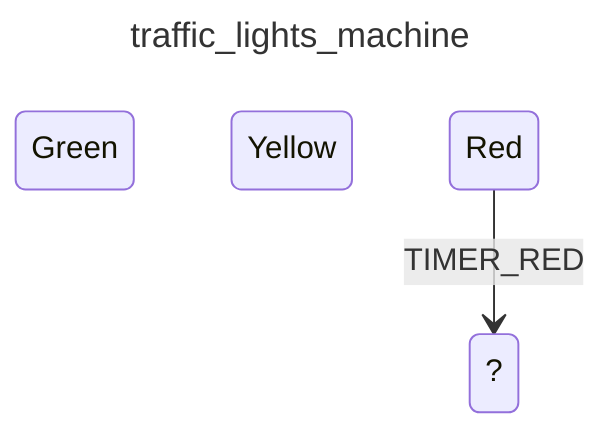

<div class="grid grid-cols-3 gap-4">

<div class="col-span-2">

# ⚙ Transitions III

```php {4-8} {maxHeight:'400px'}
[
    'id' => 'traffic_lights_machine',
    'states' => [
        'red' => [
            'on' => [
                'TIMER_RED' => '?'
            ]
        ],
        'yellow',
        'green',
    ],
]
```
</div>

<div class="text-center">



</div>
</div>

<!--
Bu transition'u tetikleyen event'i yazdik
-->
