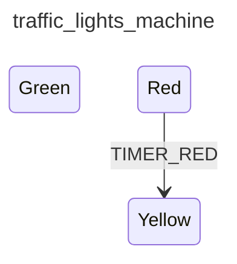

<div class="grid grid-cols-3 gap-4">

<div class="col-span-2">

# ⚙ Transitions IV

```php {4-8} {maxHeight:'400px'}
[
    'id' => 'traffic_lights_machine',
    'states' => [
        'red' => [
            'on' => [
                'TIMER_RED' => 'yellow'
            ]
        ],
        'yellow',
        'green',
    ],
]
```
</div>

<div class="text-center">



</div>
</div>

<!--
karsisina da bu machine bu event'le karsilastiginda verecegi tepkiyi yani yeni durum'u/state'i yaziyoruz

diagram da ona gore guncellendi

Red'den Yellow'a TIMER_RED event'inin tetikledigi transition ile gidiyoruz.

burada dikkat cekmek istedigim diger onemli bir nokta:
bu transition red state'inin altinda tanimli

yani eger Red state'de degilsek TIMER_RED event'i makineye gelse bile makine tepki vermeyecek cunku, bu event'i bu red state'te karsiliyoruz, yani anca bu durumda makinenin buna bir cevabi var

hatta sadece su anki config uzerinden konusursak; bu makine sadece red state'te bulundugu zaman bir TIMER_RED event'i gelirse tepki veriyor onun disinda hic bisi yapmiyor

zaten ona da bir kere tepki verebilir, cunku hemen yellow state'e geciyor ve orada duruyor

neden, cunku yellow state'te herhangi bi transition tanimli degil
-->
