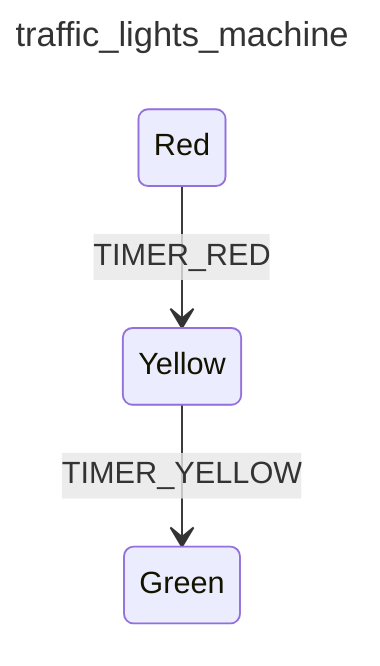

<div class="grid grid-cols-3 gap-4">

<div class="col-span-2">

# ⚙ Transitions V

```php {9-13} {maxHeight:'400px'}
[
    'id' => 'traffic_lights_machine',
    'states' => [
        'red' => [
            'on' => [
                'TIMER_RED' => 'yellow'
            ]
        ],
        'yellow' => [
            'on' => [
                'TIMER_YELLOW' => 'green'
            ]
        ],
        'green',
    ],
]
```
</div>

<div class="text-center">



</div>
</div>

<!--
burada yellow state durumundaki diger bir transition'u tanimliyoruz

yellow state'deyken bir TIMER_YELLOW event'i geldigi zaman green state'e gecsin diye tanimliyoruz.

bunu guncellenmis diagram'da da gorebiliriz
-->
