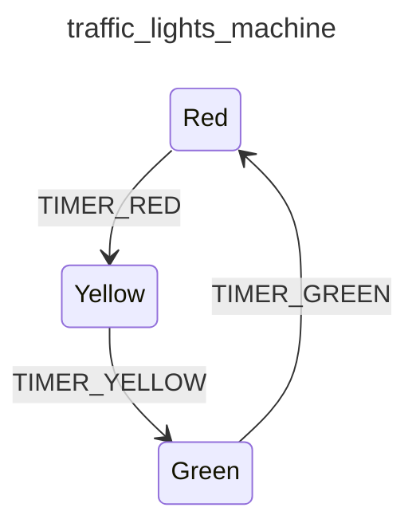

<div class="grid grid-cols-3 gap-4">

<div class="col-span-2">

# ⚙ Transitions VII

```php {maxHeight:'400px'}
[
    'id' => 'traffic_lights_machine',
    'states' => [
        'red' => [
            'on' => [
                'TIMER_RED' => 'yellow'
            ]
        ],
        'yellow' => [
            'on' => [
                'TIMER_YELLOW' => 'green'
            ]
        ],
        'green' => [
            'on' => [
                'TIMER_GREEN' => 'red'
            ]
        ],
    ],
]
```
</div>

<div class="text-center">



</div>
</div>

<style>
    code {
        @apply text-xs leading-relaxed;
    }
</style>

<!--
tumt transition'lari bir arada gorelim ve diagrami inceleyelim,

diagram'da da gorunebilecegi gibi artik her bir state icinde bir transition tanimli

diagrama bakinca artik makine bir donguye girmis gibi gorunuyor
beklenen bir event geldiginde tanimli diger state'e gidiyor

bu sekilde makine surekli calisabilir halde diyebiliriz belki

fakat makineyi calistirabilmek icin aslinda hala bisi eksik?
-->
